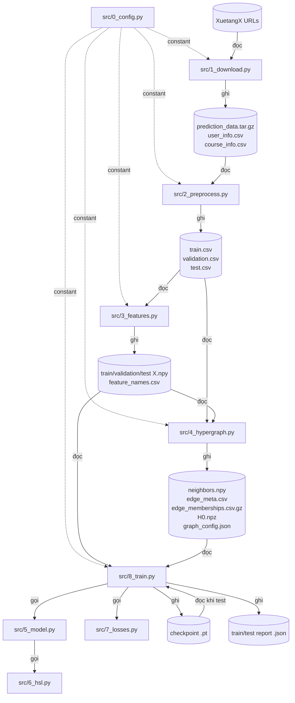
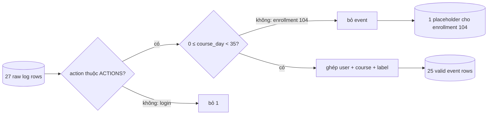
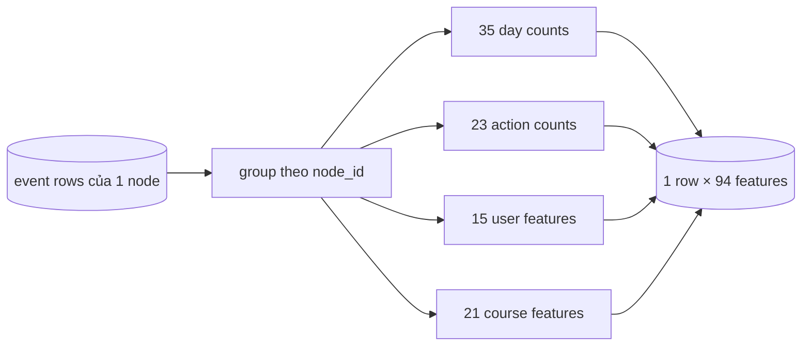
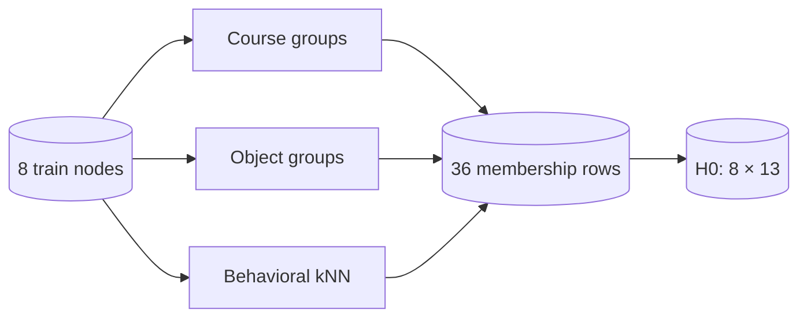

# CODE WALKTHROUGH — XuetangX dropout prediction với HGNN + HSL

Tài liệu này đọc code theo hướng **dữ liệu đi đâu và đổi hình dạng như thế nào**. Mọi số liệu trong ví dụ được lấy từ lần chạy thật của `demo_data/run_demo.py`; script đã gọi trực tiếp các hàm của project tại `demo_data/run_demo.py:243-293`. Bộ demo, artifact và kết quả đầy đủ nằm trong `demo_data/raw_source/` và `demo_data/generated/`; script ghi snapshot vào `demo_data/generated/demo_summary.json` tại `demo_data/run_demo.py:288-293`.

> Quy ước: `enrollment` là một lần một học viên đăng ký một course; project coi mỗi enrollment là một node, không coi mỗi `user_id` là một node (`README.md:3-5`).

## Phần 1. Bản đồ tổng quan

### 1.1. Mỗi file làm gì?

| File | Vai trò một câu | Input | Output | Hàm/lớp chính | Import/gọi |
|---|---|---|---|---|---|
| `src/0_config.py` | Giữ đường dẫn, seed, split, action vocabulary và vị trí feature (`src/0_config.py:6-12`, `src/0_config.py:27-31`, `src/0_config.py:59-99`). | Không đọc data. | Không ghi data; cung cấp constant. | Không có function. | `1`, `2`, `3`, `4`, `8` import bằng `import_module` (`src/1_download.py:6`, `src/2_preprocess.py:20`, `src/3_features.py:20`, `src/4_hypergraph.py:26`, `src/8_train.py:23`). |
| `src/1_download.py` | Tải ba raw artifact nếu file đích chưa tồn tại (`src/1_download.py:10-21`). | URL trong `DOWNLOAD_FILES` (`src/0_config.py:15-23`). | `prediction_data.tar.gz`, `user_info.csv`, `course_info.csv` trong raw dir (`src/0_config.py:8`, `src/0_config.py:16-23`). | `download`. | Import `0_config` (`src/1_download.py:6`). |
| `src/2_preprocess.py` | Đọc metadata + archive, giữ official test, chia raw train thành train/validation và ghi ba CSV event đã ghép (`src/2_preprocess.py:185-259`). | Ba raw artifact (`src/2_preprocess.py:188-190`). | `train.csv`, `validation.csv`, `test.csv` (`src/2_preprocess.py:97-103`). | `read_csv`, `write_csv`, `load_nodes`, `read_prediction_data`, `split_train_enrollments`, `stream_events`, `preprocess`. | Import `0_config` (`src/2_preprocess.py:20`). |
| `src/3_features.py` | Gom event theo node, tạo 94 feature, fit thống kê trên train và transform cả ba split (`src/3_features.py:218-293`). | Ba split CSV (`src/3_features.py:223-228`). | Mỗi split có `X.npy`; thêm `feature_names.csv` (`src/3_features.py:279-292`). | `feature_columns`, `feature_metadata`, `set_one_hot`, `numeric_statistics`, `scale_numeric`, `build_split_features`, `build_features`. | Import `0_config`, dùng `read_csv`/`write_csv` từ `2_preprocess` (`src/3_features.py:20-23`). |
| `src/4_hypergraph.py` | Tạo Course/Object/Behavioral hyperedge, `H0`, neighbor và local graph cho validation/test (`src/4_hypergraph.py:264-313`, `src/4_hypergraph.py:341-435`). | Split CSV và `X.npy` (`src/4_hypergraph.py:266-289`). | `neighbors.npy`, `edge_meta.csv`, `edge_memberships.csv.gz`, `H0.npz`, `graph_config.json` (`src/4_hypergraph.py:276-311`). | `behavioral_neighbors`, `course_groups`, `object_groups`, `objects_by_node`, `write_hyperedges`, `build_h0`, `build_hypergraph`, `load_train_graph`, `load_evaluation_data`, `build_local_graph`. | Import `0_config`, helper của `2_preprocess`, `feature_columns` của `3_features` (`src/4_hypergraph.py:26-31`). |
| `src/5_model.py` | Định nghĩa HGNN propagation, hai lượt encode qua `H0` và `H*`, rồi sinh dropout logit (`src/5_model.py:68-74`, `src/5_model.py:104-155`). | Feature tensor, incidence matrix, edge metadata. | `logits`, `z0`, `z_star`, `h_star` (`src/5_model.py:150-155`). | `to_torch_sparse`, `_hypergraph_operator`, `_propagate`, `HGSLModel.encode`, `HGSLModel.forward`. | Import `refine_hypergraph` từ `6_hsl` (`src/5_model.py:18-19`). |
| `src/6_hsl.py` | Chọn hyperedge/candidate node, học membership và lắp sparse `H*` (`src/6_hsl.py:335-418`). | `z0`, `H0`, family, size và các layer scoring. | Sparse tensor `H*` (`src/6_hsl.py:411-418`). | `_edge_size_bucket`, `select_hyperedges`, `sample_negative_nodes`, `_candidate_nodes`, `_membership_scores`, `_select_memberships`, `_assemble_h_star`, `_validate_refinement_inputs`, `_refine_one_edge`, `refine_hypergraph`. | Được `5_model.py` gọi (`src/5_model.py:127-141`). |
| `src/7_losses.py` | Tính class weight, contrastive loss và tổng loss (`src/7_losses.py:14-20`, `src/7_losses.py:23-86`). | Label, model output, sampled node indices. | Scalar loss và hai thành phần `bce`, `contrastive` (`src/7_losses.py:81-86`). | `train_pos_weight`, `contrastive_loss`, `total_loss`. | Được `8_train.py` import (`src/8_train.py:26`, `src/8_train.py:32-33`). |
| `src/8_train.py` | Train full-batch, đánh giá validation, chọn checkpoint theo validation AUC rồi test (`src/8_train.py:427-511`, `src/8_train.py:602-758`). | Processed graph/features; tham số train. | `.pt`, `_train.json`, `_test.json` (`src/8_train.py:381-387`, `src/8_train.py:595-596`, `src/8_train.py:754-757`). | Metric helpers, batching, `evaluate`, seed/device helpers, epoch/checkpoint helpers, `train`, `test`. | Import `4_hypergraph`, `5_model`, `7_losses` (`src/8_train.py:23-33`). |
| `demo_data/run_demo.py` | Dựng raw archive, chạy pipeline thật và chụp lại các trạng thái để viết tài liệu (`demo_data/run_demo.py:61-76`, `demo_data/run_demo.py:243-293`). | Sáu CSV nhỏ trong `demo_data/raw_source/`. | Toàn bộ artifact trong `demo_data/generated/` và `demo_summary.json`. | `prepare_raw_data`, `raw_feature_summary`, `selected_matrix_rows`, `build_summary`, `main`. | Gọi trực tiếp module `0`, `2`, `3`, `4`, `8` (`demo_data/run_demo.py:26-30`). |

### 1.2. Từ điển function: input → output

Các dòng dưới đây mô tả contract thực tế thấy trong code, không suy diễn ngoài code.

#### `src/1_download.py`

| Function | Input | Output/side effect |
|---|---|---|
| `download(raw_dir)` | Path thư mục raw. | Tạo thư mục; với mỗi URL, bỏ qua nếu file đã có, nếu chưa thì tải về (`src/1_download.py:10-21`). |

#### `src/2_preprocess.py`

| Function | Input | Output/side effect |
|---|---|---|
| `read_csv(path)` | CSV UTF-8. | Iterator các `dict` theo từng dòng (`src/2_preprocess.py:23-26`). |
| `write_csv(path, columns, rows)` | Path, header, iterable dòng. | Ghi một CSV UTF-8 (`src/2_preprocess.py:29-34`). |
| `load_nodes(path)` | Split CSV có `node_id`. | Một row đại diện cho mỗi node, sắp theo `node_id`; row đầu của node được giữ (`src/2_preprocess.py:37-44`). |
| `read_prediction_data(path, selected_names)` | `.tar.gz` và tập tên member cần đọc. | Stream `(tên_file, row)`; không giải nén ra ổ đĩa (`src/2_preprocess.py:47-59`). |
| `split_train_enrollments(ids)` | Danh sách train enrollment ID. | Mapping enrollment → `train`/`validation`; shuffle seed cố định rồi cắt 80% (`src/2_preprocess.py:62-74`, `src/0_config.py:29-30`). |
| `stream_events(...)` | Archive, metadata user/course, label, split mapping, node mapping. | Ghi ba split CSV; trả `(raw_event_count, event_counts, empty_event_rows)` (`src/2_preprocess.py:77-181`). |
| `preprocess(raw_dir, output_dir)` | Raw directory. | Điều phối toàn bước, trả report; nếu đủ ba output đã có thì skip (`src/2_preprocess.py:185-259`). |

#### `src/3_features.py`

| Function | Input | Output |
|---|---|---|
| `feature_columns(feature_set)` | Tên `behavior`, `behavior_user`, `behavior_course` hoặc `full`. | Slice/index của các cột tương ứng (`src/3_features.py:26-37`). |
| `feature_metadata()` | Không có. | 94 cặp `(feature_name, source)` theo đúng thứ tự matrix (`src/3_features.py:40-85`, `src/0_config.py:71-92`). |
| `set_one_hot(...)` | Matrix, row, giá trị, vocabulary, offset. | Sửa matrix tại cột known/missing/other (`src/3_features.py:88-97`). |
| `numeric_statistics(train_values)` | Một vector số của train có thể chứa `NaN`. | `(median, mean, std)` sau median imputation; `std=0` được thay bằng `1` (`src/3_features.py:100-109`). |
| `scale_numeric(raw_values, statistics)` | Vector cần transform và thống kê train. | Vector chuẩn hóa và missing indicator (`src/3_features.py:112-118`). |
| `build_split_features(data_path)` | Một split CSV hoàn chỉnh. | Năm object: behavior counts, user one-hot, course one-hot, raw age, raw duration (`src/3_features.py:121-215`). |
| `build_features(output_dir)` | Thư mục chứa ba split CSV. | Fit train, transform ba split, ghi ba `X.npy` và `feature_names.csv` (`src/3_features.py:218-293`). |

#### `src/4_hypergraph.py`

| Function | Input | Output |
|---|---|---|
| `behavioral_neighbors(...)` | Train/query feature matrix, số neighbor, cờ loại self. | Ma trận ID train neighbor bằng cosine-like inner product sau L2 normalize, tìm bằng FAISS HNSW (`src/4_hypergraph.py:35-87`). |
| `course_groups(nodes)` | Node metadata. | `course_id → set(node_id)` (`src/4_hypergraph.py:90-95`). |
| `object_groups(data_path)` | Một split CSV. | `(course, object, type) → set(node_id)` cho action có object (`src/4_hypergraph.py:98-107`). |
| `objects_by_node(data_path)` | Một split CSV. | `node_id → set(object key)` (`src/4_hypergraph.py:110-119`). |
| `object_key_sort_key(key)` | Object key. | Tuple sort `(course, type, object)` (`src/4_hypergraph.py:122-124`). |
| `write_edge(...)` | Writer, metadata và member set. | Ghi một edge nếu có ít nhất hai node; trả next edge ID (`src/4_hypergraph.py:127-156`). |
| `write_hyperedges(...)` | Course groups, object groups, neighbors. | Ghi membership/meta của ba family; trả edge count và family counts (`src/4_hypergraph.py:159-240`). |
| `build_h0(output_dir, train_count)` | Edge files. | Sparse CSR `H0`, đồng thời ghi `H0.npz` (`src/4_hypergraph.py:243-260`). |
| `build_hypergraph(...)` | Processed dir, `k`, `k_max`. | Neighbor files + train hypergraph + report/config (`src/4_hypergraph.py:263-313`). |
| `load_train_graph(...)` | Processed dir và feature set. | Train `X`, `H0`, labels, edge families, edge sizes (`src/4_hypergraph.py:316-337`). |
| `load_evaluation_data(...)` | Processed dir, split name, feature set. | Dictionary target + **train-only reference** (`src/4_hypergraph.py:340-374`). |
| `build_local_graph(data, target_node_id)` | Evaluation dictionary và một target node. | Local `X`, local `H0`, family, size, label; target ở local row 0 (`src/4_hypergraph.py:377-435`). |

#### `src/5_model.py`, `src/6_hsl.py`, `src/7_losses.py`

| Function/lớp | Input | Output |
|---|---|---|
| `to_torch_sparse` | SciPy sparse matrix, device. | Coalesced PyTorch sparse tensor (`src/5_model.py:22-39`). |
| `_hypergraph_operator` | Sparse incidence tensor. | `H`, `Hᵀ`, node scale, edge scale; từ chối isolated node/empty edge (`src/5_model.py:42-64`). |
| `_propagate` | Operator trên và node features. | Message node → edge → node đã degree-normalize (`src/5_model.py:67-74`). |
| `HGSLModel.__init__` | `input_dim`, `hidden_dim`, dropout. | Tạo 2 linear HGNN layer, membership projections và classifier (`src/5_model.py:78-90`). |
| `HGSLModel.encode` | Node features, incidence matrix. | Node embedding sau hai propagation layer (`src/5_model.py:92-102`). |
| `HGSLModel.forward` | `X`, `H0`, edge metadata, RNG, HSL settings. | `logits`, `z0`, `z_star`, `h_star` (`src/5_model.py:104-155`). |
| `_edge_size_bucket` | Edge size. | `small` nếu ≤10, `medium` nếu ≤100, còn lại `large` (`src/6_hsl.py:17-23`). |
| `select_hyperedges` | Family, size, budget, RNG. | Edge IDs lấy round-robin theo family/bucket (`src/6_hsl.py:26-49`). |
| `sample_negative_nodes` | Node count, current members, count, RNG và tùy chọn group. | Non-member node IDs (`src/6_hsl.py:52-95`). |
| `_candidate_nodes` | Current members + positive/negative budget. | Positive IDs và toàn bộ candidate IDs (`src/6_hsl.py:98-128`). |
| `_membership_scores` | `z0`, positive/candidate IDs và projection layers. | Một score cho mỗi candidate (`src/6_hsl.py:131-156`). |
| `_select_memberships` | Scores, positive count, top-r/threshold. | Candidate positions được giữ, luôn cố giữ ít nhất một positive (`src/6_hsl.py:159-178`). |
| `_assemble_h_star` | `H0`, selected edges, learned memberships. | Differentiable sparse `H*`, đồng thời phục hồi node bị cô lập (`src/6_hsl.py:181-241`). |
| `_validate_refinement_inputs` | Shapes/settings. | Không trả data; raise khi không khớp (`src/6_hsl.py:244-269`). |
| `_refine_one_edge` | Một edge cùng embeddings/settings. | Node IDs, edge IDs, sigmoid membership values mới (`src/6_hsl.py:272-332`). |
| `refine_hypergraph` | Toàn graph + scoring model. | Chọn/refine edges rồi lắp `H*` (`src/6_hsl.py:335-418`). |
| `train_pos_weight` | Binary train labels. | `negative_count / positive_count` (`src/7_losses.py:14-20`). |
| `contrastive_loss` | `z0`, `z_star`, sampled IDs, temperature. | Symmetric cross-entropy giữa hai embedding views (`src/7_losses.py:23-53`). |
| `total_loss` | Model output, label, weight, sampled IDs. | `BCE + lambda_cl × contrastive` và component dictionary (`src/7_losses.py:56-86`). |

#### `src/8_train.py`

| Function | Chức năng và output |
|---|---|
| `_average_ranks`, `_roc_auc`, `_average_precision`, `_threshold_metrics`, `metrics` | Tự tính rank, ROC-AUC, AUPRC và precision/recall/F1 ở threshold 0.5 (`src/8_train.py:36-123`). |
| `_batch_graphs` | Ghép nhiều local graph thành block-diagonal batch và lưu vị trí target (`src/8_train.py:126-163`). |
| `_evaluation_targets` | Chọn target xác định theo seed; nếu limit thì giữ cả hai lớp (`src/8_train.py:166-196`). |
| `evaluate` | Dựng local graph, chạy deterministic inference, sigmoid logit, trả metrics và target count (`src/8_train.py:199-249`). |
| `_set_seed`, `_device` | Seed Python/NumPy/PyTorch và chọn CPU/CUDA (`src/8_train.py:252-267`). |
| `_check_hsl_gradients` | Đảm bảo gradient HSL hữu hạn và khác 0 (`src/8_train.py:270-285`). |
| `_refinement_settings` | Ghép override vào HSL default (`src/8_train.py:288-299`). |
| `_model_variant_name` | Trả `hgsl` hoặc `hgnn` cho tên run (`src/8_train.py:302-306`). |
| `_train_one_epoch` | Forward, total loss, backward, gradient clip, optimizer step (`src/8_train.py:309-369`). |
| `_save_checkpoint` | Ghi state, epoch, validation, input dim, settings (`src/8_train.py:372-387`). |
| `_build_training_settings` | Gom hyperparameter thành dictionary serializable (`src/8_train.py:390-424`). |
| `_run_training_epochs` | Lặp epoch, validate, giữ checkpoint khi AUC tăng, early-stop theo patience (`src/8_train.py:427-511`). |
| `_initialize_training_components` | Load graph, tạo tensors/model/Adam/class weight (`src/8_train.py:514-558`). |
| `_prepare_training_paths` | Tạo output dirs và tên run/checkpoint (`src/8_train.py:561-570`). |
| `_write_training_report` | Ghi JSON train report (`src/8_train.py:573-598`). |
| `train` | Điều phối toàn training và trả train report (`src/8_train.py:601-705`). |
| `test` | Load checkpoint đã chọn, chạy official test, ghi test report (`src/8_train.py:708-758`). |

### 1.3. Sơ đồ file code ↔ file dữ liệu



Các cạnh đọc/ghi trên sơ đồ tương ứng với đường dẫn raw ở `src/0_config.py:7-11`, ba input preprocess ở `src/2_preprocess.py:188-190`, feature outputs ở `src/3_features.py:279-292`, graph outputs ở `src/4_hypergraph.py:276-311`, checkpoint/report ở `src/8_train.py:381-387`, `src/8_train.py:595-596`, `src/8_train.py:754-757`.

### 1.4. Thứ tự chạy

Project có 9 file `0` đến `8`, nhưng chỉ có **6 lệnh pipeline** trong README; lệnh 5 và 6 cùng gọi `src/8_train.py` ở hai mode khác nhau (`README.md:7-19`, `README.md:29-36`). Vì vậy, nếu yêu cầu “6 file” có nghĩa là sáu file Python khác nhau thì **chưa chắc**; code hiện tại thể hiện sáu bước chạy như sau:

```powershell
.\.venv\Scripts\python.exe src/1_download.py
.\.venv\Scripts\python.exe src/2_preprocess.py
.\.venv\Scripts\python.exe src/3_features.py
.\.venv\Scripts\python.exe src/4_hypergraph.py --k 10 --k-max 20
.\.venv\Scripts\python.exe src/8_train.py --seed 1 --feature-set full --epochs 50
.\.venv\Scripts\python.exe src/8_train.py --mode test --checkpoint outputs/runs/simple_hgsl_full_seed_1.pt
```

Các CLI argument tương ứng nằm ở `src/1_download.py:24-27`, `src/2_preprocess.py:262-267`, `src/3_features.py:296-300`, `src/4_hypergraph.py:438-448`, `src/8_train.py:761-810`.

Để tái tạo đúng toàn bộ số trong tài liệu này, chạy một lệnh dưới đây; demo dùng `k=2`, `k_max=3` và 2 epoch vì chỉ có 8 train node (`demo_data/run_demo.py:243-280`):

```powershell
.\.venv\Scripts\python.exe demo_data/run_demo.py
```

## Phần 2. Dữ liệu mẫu từ đầu

### 2.1. Cấu trúc raw demo

Demo có 5 user, 3 course, 10 train enrollments, 2 official-test enrollments và 27 log rows: 23 train + 4 test (`demo_data/raw_source/user_info.csv:2-6`, `demo_data/raw_source/course_info.csv:2-4`, `demo_data/raw_source/train_truth.csv:2-11`, `demo_data/raw_source/test_truth.csv:2-3`, `demo_data/raw_source/train_log.csv:2-24`, `demo_data/raw_source/test_log.csv:2-5`). Script đóng bốn file log/truth vào `prediction_data.tar.gz` và copy hai file metadata cạnh archive (`demo_data/run_demo.py:61-76`).

#### `user_info.csv` — toàn bộ 5 dòng

| user_id | gender | education | birth |
|---:|---|---|---:|
| 10 | female | Bachelor's | 1995 |
| 11 | male | Master's | 1988 |
| 12 | no data | High | 2003 |
| 13 | female | N/A | 1990 |
| 14 | nonbinary | Doctorate | *(rỗng)* |

Nguồn bảng: `demo_data/raw_source/user_info.csv:1-6`. `no data`, `N/A` và chuỗi rỗng có chủ ý để chạy thật nhánh missing; vocabulary missing được định nghĩa tại `src/0_config.py:69`.

#### `course_info.csv` — toàn bộ 3 dòng

| course_id | start | end | category |
|---|---|---|---|
| course_A | 2024-01-01 | 2024-03-01 | computer |
| course_B | 2024-01-05 | 2024-02-20 | math |
| course_C | 2024-02-01 | N/A | business |

Nguồn bảng: `demo_data/raw_source/course_info.csv:1-4`. `course_C.end=N/A` kích hoạt duration missing ở `src/3_features.py:169-179`, `src/3_features.py:203-208`.

#### Label raw

| Nguồn | enroll_id → truth |
|---|---|
| train | 100→0, 101→0, 102→1, 103→1, 104→1, 105→0, 106→1, 107→0, 108→1, 109→0 |
| official test | 200→0, 201→1 |

Nguồn bảng: `demo_data/raw_source/train_truth.csv:1-11`, `demo_data/raw_source/test_truth.csv:1-3`. Code chuyển `truth` thành integer label mà không tự suy ra từ log (`src/2_preprocess.py:212-220`). Theo README, `truth=1` được gọi là dropout (`README.md:64-71`).

Ba tình huống được cài vào demo là: enrollment 100 đại diện trường hợp **hoàn thành/không dropout** với `truth=0` và 3 event hợp lệ (`demo_data/raw_source/train_truth.csv:2`, `demo_data/raw_source/train_log.csv:2-4`); enrollment 103 đại diện **dropout** với `truth=1` (`demo_data/raw_source/train_truth.csv:5`, `demo_data/raw_source/train_log.csv:9-11`); enrollment 104 đại diện **ít hoạt động** với đúng 1 event nhưng event đó nằm ngoài cửa sổ 35 ngày (`demo_data/raw_source/train_truth.csv:6`, `demo_data/raw_source/train_log.csv:12`). “Hoàn thành” ở đây là ý nghĩa thiết kế của bộ giả; code chỉ quan sát class 0 là “không dropout”, không có cột completion riêng (`src/2_preprocess.py:212-220`).

#### Toàn bộ 27 log rows

`session_id` và `source` có trong raw nhưng preprocess không ghi sang split output; code chỉ lấy `enroll_id`, `username`, `course_id`, `action`, `object`, `time` (`src/2_preprocess.py:113-148`).

| # | source file | enroll | user | course | action | object | time |
|---:|---|---:|---:|---|---|---|---|
| 1 | train | 100 | 10 | A | play_video | video_A_shared | 2024-01-01 |
| 2 | train | 100 | 10 | A | pause_video | video_A_shared | 2024-01-02 |
| 3 | train | 100 | 10 | A | problem_check | problem_A_shared | 2024-01-04 |
| 4 | train | 101 | 10 | B | click_courseware | page_B_1 | 2024-01-05 |
| 5 | train | 101 | 10 | B | play_video | video_B_shared | 2024-01-06 |
| 6 | train | 102 | 11 | A | play_video | video_A_shared | 2024-01-03 |
| 7 | train | 102 | 11 | A | problem_check | problem_A_shared | 2024-01-05 |
| 8 | train | 103 | 11 | C | create_thread | thread_C_shared | 2024-02-01 |
| 9 | train | 103 | 11 | C | create_comment | thread_C_shared | 2024-02-02 |
| 10 | train | 103 | 11 | C | play_video | video_C_shared | 2024-02-03 |
| 11 | train | 104 | 12 | B | play_video | video_B_shared | 2024-03-15 |
| 12 | train | 105 | 12 | C | load_video | video_C_shared | 2024-02-01 |
| 13 | train | 105 | 12 | C | play_video | video_C_shared | 2024-02-02 |
| 14 | train | 106 | 13 | A | play_video | video_A_shared | 2024-01-02 |
| 15 | train | 106 | 13 | A | pause_video | video_A_shared | 2024-01-02 |
| 16 | train | 106 | 13 | A | stop_video | video_A_shared | 2024-01-03 |
| 17 | train | 107 | 13 | B | problem_get | problem_B_shared | 2024-01-05 |
| 18 | train | 107 | 13 | B | problem_check | problem_B_shared | 2024-01-06 |
| 19 | train | 108 | 14 | C | click_info | page_C_1 | 2024-02-01 |
| 20 | train | 108 | 14 | C | create_thread | thread_C_shared | 2024-02-03 |
| 21 | train | 109 | 14 | A | seek_video | video_A_shared | 2024-01-01 |
| 22 | train | 109 | 14 | A | play_video | video_A_shared | 2024-01-02 |
| 23 | train | 109 | 14 | A | login | *(rỗng)* | 2024-01-03 |
| 24 | test | 200 | 10 | C | play_video | video_C_shared | 2024-02-01 |
| 25 | test | 200 | 10 | C | stop_video | video_C_shared | 2024-02-02 |
| 26 | test | 201 | 11 | B | problem_get | problem_B_shared | 2024-01-05 |
| 27 | test | 201 | 11 | B | problem_check_correct | problem_B_shared | 2024-01-06 |

Nguồn 23 dòng train: `demo_data/raw_source/train_log.csv:2-24`; nguồn 4 dòng test: `demo_data/raw_source/test_log.csv:2-5`. Enrollment 104 là “ít hoạt động” nhưng event duy nhất nằm ngoài cửa sổ 35 ngày; enrollment 109 có action `login` không thuộc `ACTIONS`, nên hai dòng này đi qua hai nhánh loại bỏ khác nhau (`src/2_preprocess.py:125-132`; bằng chứng run: `demo_data/generated/demo_summary.json:818-840`).

## Phần 3. Theo dõi dữ liệu qua từng bước

### Bước 1 — Đóng gói raw giống input mà pipeline chờ

**Code:** demo tạo archive tại `demo_data/run_demo.py:61-76`; production downloader tải đúng ba artifact đã cấu hình tại `src/0_config.py:15-23` bằng `src/1_download.py:10-21`.

**Trước:** 6 CSV dễ đọc trong `demo_data/raw_source/`; `train_log.csv` có shape `(23, 8)`, `test_log.csv` có `(4, 8)`, `user_info.csv` có `(5, 4)` và `course_info.csv` có `(3, 4)` theo snapshot thật (`demo_data/generated/demo_summary.json:14-263`).

**Sau:** thư mục `demo_data/generated/raw/xuetangx/` có `user_info.csv`, `course_info.csv` và `prediction_data.tar.gz`; archive chứa đúng `train_log.csv`, `test_log.csv`, `train_truth.csv`, `test_truth.csv` (`demo_data/generated/demo_summary.json:2-7`).

**Cái gì đã thay đổi:** bốn CSV log/truth chỉ được đóng gói, không sửa row/column; hai metadata CSV được copy (`demo_data/run_demo.py:65-75`). Demo không gọi Internet/download thật, vì mục tiêu là một lần chạy có thể tái tạo từ dữ liệu nhỏ cục bộ; do đó trạng thái server XuetangX hiện tại là **chưa chắc**.

### Bước 2 — Preprocess: ghép, chia và lọc cửa sổ 35 ngày

**Code:** `preprocess` đọc metadata/label ở `src/2_preprocess.py:185-238`, chia split ở `src/2_preprocess.py:62-74`, stream event ở `src/2_preprocess.py:77-181` và ghi ba CSV ở `src/2_preprocess.py:97-103`.

**Đọc:** ba raw artifact. **Ghi:** `processed/train.csv`, `processed/validation.csv`, `processed/test.csv` (`src/2_preprocess.py:188-192`, `src/2_preprocess.py:239-247`).

**TRƯỚC — 5 dòng đầu `train_log.csv`, shape `(23, 8)`** (`demo_data/generated/demo_summary.json:67-151`):

| enroll_id | username | course_id | action | object | time |
|---:|---:|---|---|---|---|
| 100 | 10 | course_A | play_video | video_A_shared | 2024-01-01T08:00:00 |
| 100 | 10 | course_A | pause_video | video_A_shared | 2024-01-02T08:05:00 |
| 100 | 10 | course_A | problem_check | problem_A_shared | 2024-01-04T10:00:00 |
| 101 | 10 | course_B | click_courseware | page_B_1 | 2024-01-05T09:00:00 |
| 101 | 10 | course_B | play_video | video_B_shared | 2024-01-06T09:10:00 |

Columns trước là `enroll_id, username, course_id, session_id, action, object, time, source` (`demo_data/raw_source/train_log.csv:1`).

**SAU — 5 dòng đầu `train.csv`, shape `(18, 14)`** (`demo_data/generated/demo_summary.json:282-367`):

| node_id | enroll_id | user_id | course_id | label | gender | education | course_start | category | action | object_id | course_day |
|---:|---:|---:|---|---:|---|---|---|---|---|---|---:|
| 0 | 100 | 10 | course_A | 0 | female | Bachelor's | 2024-01-01 | computer | play_video | video_A_shared | 0 |
| 0 | 100 | 10 | course_A | 0 | female | Bachelor's | 2024-01-01 | computer | pause_video | video_A_shared | 1 |
| 0 | 100 | 10 | course_A | 0 | female | Bachelor's | 2024-01-01 | computer | problem_check | problem_A_shared | 3 |
| 1 | 103 | 11 | course_C | 1 | male | Master's | 2024-02-01 | business | create_thread | thread_C_shared | 0 |
| 1 | 103 | 11 | course_C | 1 | male | Master's | 2024-02-01 | business | create_comment | thread_C_shared | 1 |

Columns sau đầy đủ là `node_id, enroll_id, user_id, course_id, label, gender, education, birth, course_start, course_end, category, action, object_id, course_day` (`src/2_preprocess.py:91-95`; snapshot thật `demo_data/generated/demo_summary.json:288-302`).

**SAU — kích thước cả ba split:** train `(18,14)`, validation `(4,14)`, test `(4,14)` (`demo_data/generated/demo_summary.json:282-578`). Tuy train có 18 dòng event/placeholder, nó chỉ có 8 node; validation/test mỗi tập có 2 node (`demo_data/generated/demo_summary.json:264-280`).

**Cái gì đã thay đổi:**

- `username` đổi tên thành `user_id`; `object` đổi thành `object_id`; `session_id` và `source` bị bỏ; thêm `node_id`, `label`, 6 trường user/course context và `course_day` (`src/2_preprocess.py:91-95`, `src/2_preprocess.py:135-150`).
- `course_day = event_date - course_start`; chỉ giữ `0 <= course_day < 35` (`src/2_preprocess.py:129-132`, `src/0_config.py:31`).
- Action ngoài vocabulary bị bỏ trước khi tính feature; trong run thật, dòng `login` của enrollment 109 bị bỏ (`src/2_preprocess.py:125-127`; `demo_data/generated/demo_summary.json:818-828`).
- Enrollment 104 không còn event hợp lệ, nên code ghi một placeholder với `action/object_id/course_day` rỗng để node không biến mất (`src/2_preprocess.py:154-179`; report thật có 1 train placeholder tại `demo_data/generated/demo_summary.json:276-279`).
- Tổng 27 raw rows thành 17 valid train event + 4 validation + 4 test + 1 train placeholder; vì 2 raw rows bị loại nhưng 1 placeholder được thêm, tổng processed rows là 26 (`demo_data/generated/demo_summary.json:264-280`).



Các con số trên sơ đồ là output thật tại `demo_data/generated/demo_summary.json:264-280`, `demo_data/generated/demo_summary.json:818-840`.

### Bước 3 — Event rows → một feature row cho mỗi node

**Code:** `build_split_features` khởi tạo counter, group theo `node_id`, tăng day/action count và tạo user/course context ở `src/3_features.py:121-215`. `build_features` fit/transform và ghi matrix ở `src/3_features.py:218-293`.

**Đọc:** ba processed CSV. **Ghi:** `train/X.npy`, `validation/X.npy`, `test/X.npy`, `feature_names.csv` (`src/3_features.py:223-228`, `src/3_features.py:279-292`).

**TRƯỚC — 5 node train đầu dưới dạng raw behavior count** (`demo_data/generated/demo_summary.json:842-920`):

| node_id | Các feature count khác 0 |
|---:|---|
| 0 | day_0=1, day_1=1, day_3=1, play_video=1, pause_video=1, problem_check=1 |
| 1 | day_0=1, day_1=1, day_2=1, play_video=1, create_thread=1, create_comment=1 |
| 2 | *(không có behavior nào)* |
| 3 | day_0=1, day_1=1, play_video=1, load_video=1 |
| 4 | day_1=2, day_2=1, play_video=1, pause_video=1, stop_video=1 |

Tên `action_video_2=play_video`, `action_video_3=pause_video`, `action_assignment_2=problem_check` được tạo theo đúng thứ tự `ACTION_GROUPS` (`src/0_config.py:32-48`, `src/3_features.py:50-54`). Node 2 là placeholder enrollment 104 nên vector behavior raw bằng 0 (`demo_data/generated/demo_summary.json:899-902`).

Ba block raw của train có shape behavior `(8,58)`, user `(8,15)`, course `(8,21)`; ghép lại thành 94 feature (`demo_data/generated/demo_summary.json:843-855`, `src/0_config.py:71-92`).

**SAU — 5 train node đầu, chỉ hiển thị 9/94 cột để đọc được** (`demo_data/generated/demo_summary.json:1092-1205`):

| node | day_0 | day_1 | day_2 | action_video_2 | action_assignment_2 | gender_female | age_scaled | category_computer | duration_scaled |
|---:|---:|---:|---:|---:|---:|---:|---:|---:|---:|
| 0 | 0.577350 | 0.345902 | -0.774597 | 0.774597 | 1.732051 | 1 | -0.138380 | 1 | 0.577350 |
| 1 | 0.577350 | 0.345902 | 1.290994 | 0.774597 | -0.577350 | 0 | 1.153164 | 0 | 0.577350 |
| 2 | -1.732051 | -1.609678 | -0.774597 | -1.290994 | -0.577350 | 0 | -1.614430 | 0 | -1.732051 |
| 3 | 0.577350 | 0.345902 | -0.774597 | 0.774597 | -0.577350 | 0 | -1.614430 | 0 | 0.577350 |
| 4 | -1.732051 | 1.489843 | 1.290994 | 0.774597 | -0.577350 | 1 | 0.784152 | 1 | 0.577350 |

Final shapes thật: train `(8,94)`, validation `(2,94)`, test `(2,94)` (`demo_data/generated/demo_summary.json:1092-1097`, `demo_data/generated/demo_summary.json:1208-1329`).

**Cái gì đã thay đổi:**

- Nhiều event row của cùng node được group thành đúng một feature row; code tăng cả day count và action count cho mỗi event (`src/3_features.py:127-142`).
- Behavior dùng `log1p`, rồi `(value - train_mean) / train_std` (`src/3_features.py:237-256`). Ví dụ run thật: `activity_day_0` có train mean `0.519860` và std `0.300142`; node 0 có raw count 1 nên sau `log1p`/scale nhận `0.577350` (`demo_data/generated/demo_summary.json:1065-1069`, `demo_data/generated/demo_summary.json:1116-1123`).
- Age/duration được median-impute và standardize; run thật fit age `(median=31.5, mean=29.75, std=5.419871)` và duration `(60, 56.5, 6.062178)` (`demo_data/generated/demo_summary.json:1054-1064`).
- Missing không bị giấu: ngoài giá trị imputed/scaled còn có cột `age_missing` và `course_duration_missing` (`src/3_features.py:260-273`). Trong run thật, node 1 course_C có `course_duration_missing=1` (`demo_data/generated/demo_summary.json:1134-1150`).



Kích thước từng block được định nghĩa ở `src/0_config.py:71-92` và xác nhận bằng run thật tại `demo_data/generated/demo_summary.json:843-855`.

### Bước 4 — Feature rows → hypergraph `H0`

**Code:** neighbor ở `src/4_hypergraph.py:35-87`; Course/Object/Behavioral edge ở `src/4_hypergraph.py:159-240`; sparse incidence ở `src/4_hypergraph.py:243-260`; orchestration ở `src/4_hypergraph.py:263-313`.

**Đọc:** train/validation/test `X.npy` và train CSV. **Ghi:** neighbor arrays, edge tables, `H0.npz`, graph config (`src/4_hypergraph.py:266-311`).

**TRƯỚC:** train `X` có `(8,94)`; demo truyền `k=2`, `k_max=3` (`demo_data/generated/demo_summary.json:1093-1097`, `demo_data/run_demo.py:247`).

**SAU — 8 edge đầu trong `edge_meta.csv`, shape `(13,7)`** (`demo_data/generated/demo_summary.json:1343-1421`):

| edge_id | family | course | object | type | anchor | size |
|---:|---|---|---|---|---:|---:|
| 0 | course | course_A |  |  |  | 3 |
| 1 | course | course_B |  |  |  | 2 |
| 2 | course | course_C |  |  |  | 3 |
| 3 | object | course_A | video_A_shared | video |  | 3 |
| 4 | object | course_C | thread_C_shared | forum |  | 2 |
| 5 | object | course_C | video_C_shared | video |  | 2 |
| 6 | behavioral |  |  |  | 4 | 3 |
| 7 | behavioral |  |  |  | 5 | 3 |

Run thật sinh 13 edges = 3 course + 3 object + 7 unique behavioral và 36 memberships (`demo_data/generated/demo_summary.json:1331-1341`). Object singleton không được ghi vì `write_edge` bỏ edge có dưới 2 member (`src/4_hypergraph.py:140-142`).

**SAU — 5 hàng đầu của dense `H0`, shape `(8,13)`, nnz=36** (`demo_data/generated/demo_summary.json:1479-1564`):

| node \ edge | e0 | e1 | e2 | e3 | e4 | e5 | e6 | e7 | e8 | e9 | e10 | e11 | e12 |
|---:|---:|---:|---:|---:|---:|---:|---:|---:|---:|---:|---:|---:|---:|
| 0 | 1 | 0 | 0 | 1 | 0 | 0 | 1 | 1 | 1 | 1 | 0 | 0 | 0 |
| 1 | 0 | 0 | 1 | 0 | 1 | 1 | 1 | 0 | 0 | 0 | 1 | 1 | 0 |
| 2 | 0 | 1 | 0 | 0 | 0 | 0 | 0 | 1 | 0 | 0 | 1 | 0 | 1 |
| 3 | 0 | 0 | 1 | 0 | 0 | 1 | 0 | 0 | 1 | 0 | 0 | 0 | 0 |
| 4 | 1 | 0 | 0 | 1 | 0 | 0 | 1 | 0 | 0 | 1 | 0 | 1 | 0 |

`H0[node, edge]=1` nghĩa là node thuộc hyperedge đó; matrix được tạo trực tiếp từ `(node_id, edge_id)` memberships ở `src/4_hypergraph.py:243-259`.



### Bước 5 — Local graph cho validation/test và forward model

Validation/test node không được đưa vào train `H0`; mỗi target dựng một graph cục bộ nối target tới các train reference theo course, object và behavioral neighbor (`src/4_hypergraph.py:341-435`).

**TRƯỚC:** validation node 0 là enrollment 101, course_B, label 0 (`demo_data/generated/demo_summary.json:559-594`).

**SAU:** local graph thật của node này có feature shape `(5,94)`, incidence shape `(5,2)`, hai edge family `course` và `behavioral`, mỗi edge size 3; local row 0 là target (`demo_data/generated/demo_summary.json:1676-1715`). Matrix là:

| local node | course edge | behavioral edge |
|---:|---:|---:|
| 0 (target) | 1 | 1 |
| 1 | 1 | 0 |
| 2 | 0 | 1 |
| 3 | 1 | 0 |
| 4 | 0 | 1 |

`HGSLModel.forward` encode trên `H0`, tùy chọn học `H*`, encode lần hai và đưa `z_star` qua classifier (`src/5_model.py:104-155`). HSL score candidate và lắp sparse `H*` ở `src/6_hsl.py:272-332`, `src/6_hsl.py:335-418`.

**Cái gì đã thay đổi:** target feature được đặt trước các train-reference features; incidence local chứa target trong mọi local edge, nhưng reference node chỉ đến từ train (`src/4_hypergraph.py:393-427`). Đây là cách graph evaluation tránh đưa validation/test node khác vào làm reference; nhận xét này chỉ áp dụng cấu trúc graph, không tự động loại rủi ro cùng `user_id` giữa split.

### Bước 6 — Train, chọn checkpoint, test

**Code:** một epoch tại `src/8_train.py:309-369`; epoch loop/checkpoint selection tại `src/8_train.py:427-511`; test tại `src/8_train.py:708-758`.

**TRƯỚC:** demo có 8 train nodes, positive weight `1.0`; cấu hình thật là seed 1, full 94 features, hidden 8, HSL bật, 2 epoch (`demo_data/generated/demo_summary.json:1717-1729`, `demo_data/generated/demo_summary.json:1758-1779`).

**SAU — kết quả run thật, chỉ dùng để theo dõi code, không dùng để kết luận khoa học:**

| Giai đoạn | epoch | total loss | BCE | contrastive | AUC | AUPRC | F1 |
|---|---:|---:|---:|---:|---:|---:|---:|
| validation | 1 | 0.825556 | 0.695084 | 1.304717 | 0.0 | 0.5 | 0.666667 |
| validation | 2 | 0.827892 | 0.692691 | 1.352007 | 0.0 | 0.5 | 0.666667 |
| held-out test, checkpoint epoch 1 | 1 | — | — | — | 1.0 | 1.0 | 0.666667 |

Nguồn số train/validation: `demo_data/generated/demo_summary.json:1717-1756`; nguồn test: `demo_data/generated/demo_summary.json:1782-1799`. Chỉ có 2 target mỗi validation/test nên metric này không có ý nghĩa thống kê; đây là giới hạn trực tiếp từ sample size được ghi ở `demo_data/generated/demo_summary.json:1727`, `demo_data/generated/demo_summary.json:1792`.

**Cái gì đã thay đổi:** epoch 1 có AUC 0.0 và được lưu vì tốt hơn `-∞`; epoch 2 cũng 0.0 nên không thay checkpoint (`src/8_train.py:444-509`). `test()` load đúng checkpoint epoch 1, đọc split test và chạy evaluate (`src/8_train.py:719-757`; xác nhận output `demo_data/generated/demo_summary.json:1782-1799`).

## Phần 4. Vòng đời của từng file dữ liệu

| File/artifact | Ai tạo | Ai đọc lại | Định dạng | Cột/khóa hoặc shape |
|---|---|---|---|---|
| `prediction_data.tar.gz` | `1_download.download` (`src/1_download.py:10-21`); demo tạo ở `demo_data/run_demo.py:67-75`. | `2_preprocess.read_prediction_data` (`src/2_preprocess.py:47-59`). | tar.gz chứa 4 CSV. | Log key `enroll_id`; truth key `enroll_id` (`src/2_preprocess.py:113-123`, `src/2_preprocess.py:212-220`). |
| `user_info.csv` | Downloader (`src/0_config.py:19-20`). | `preprocess` (`src/2_preprocess.py:204-206`). | CSV. | PK `user_id`; gender, education, birth. |
| `course_info.csv` | Downloader (`src/0_config.py:21-22`). | `preprocess` (`src/2_preprocess.py:208-210`). | CSV. | PK `course_id`; start, end, category. |
| `train.csv`, `validation.csv`, `test.csv` | `stream_events` (`src/2_preprocess.py:97-111`, `src/2_preprocess.py:135-179`). | Feature builder và hypergraph (`src/3_features.py:223-228`, `src/4_hypergraph.py:267-289`). | CSV, 14 cột. | Event row; node key cục bộ `node_id`, enrollment key `enroll_id` (`src/2_preprocess.py:91-95`). |
| `feature_names.csv` | `build_features` (`src/3_features.py:284-292`). | Không thấy source file nào đọc lại: **chưa chắc** nó có consumer ngoài người dùng. | CSV. | `feature_index` là khóa; `feature_name`, `source`. |
| `{split}/X.npy` | `build_features` (`src/3_features.py:275-282`). | Hypergraph và training loader (`src/4_hypergraph.py:268-286`, `src/4_hypergraph.py:320-323`, `src/4_hypergraph.py:369-372`). | NumPy float32. | `(node_count, 94)` ở full feature set (`src/0_config.py:90-93`). |
| `{split}/neighbors.npy` | `build_hypergraph` (`src/4_hypergraph.py:270-286`). | Train edges và evaluation local graph (`src/4_hypergraph.py:290-296`, `src/4_hypergraph.py:369`, `src/4_hypergraph.py:390-391`). | NumPy int32. | `(node_count, k_max)` train-reference node IDs (`src/4_hypergraph.py:69-72`). |
| `edge_memberships.csv.gz` | `write_hyperedges` (`src/4_hypergraph.py:168-190`, `src/4_hypergraph.py:193-238`). | `build_h0` (`src/4_hypergraph.py:248-252`). | gzip CSV. | Composite key `(edge_id,node_id)`. |
| `edge_meta.csv` | `write_hyperedges` (`src/4_hypergraph.py:169-190`). | `build_h0`, `load_train_graph` (`src/4_hypergraph.py:245-258`, `src/4_hypergraph.py:330-336`). | CSV. | `edge_id`; family/course/object/type/anchor/size. |
| `H0.npz` | `build_h0` (`src/4_hypergraph.py:254-260`). | `load_train_graph` (`src/4_hypergraph.py:317-323`). | SciPy sparse CSR. | Rows=train node, columns=edge. |
| `graph_config.json` | `build_hypergraph` (`src/4_hypergraph.py:300-311`). | `load_evaluation_data` (`src/4_hypergraph.py:357-374`). | JSON. | `k`, `k_max`, node/edge/incidence/family counts. |
| `simple_*_seed_*.pt` | `_save_checkpoint` (`src/8_train.py:372-387`). | `test` (`src/8_train.py:719-730`). | PyTorch checkpoint. | state_dict, epoch, validation, input_dim, settings. |
| `*_train.json` | `_write_training_report` (`src/8_train.py:573-596`). | Không thấy code đọc lại: **chưa chắc** có consumer ngoài phân tích. | JSON. | best epoch/validation, history, settings. |
| `*_test.json` | `test` (`src/8_train.py:747-757`). | Không thấy code đọc lại: **chưa chắc** có consumer ngoài phân tích. | JSON. | checkpoint info, target count, test metrics. |
| `demo_summary.json` | Demo script (`demo_data/run_demo.py:281-293`). | Tài liệu này. | JSON. | Snapshot raw/processed/feature/graph/train/test. |

## Phần 5. Những điểm quyết định kết quả nghiên cứu

### (a) Chia train/validation/test và overlap

Raw train enrollment được shuffle bằng `SPLIT_SEED=1`, lấy `int(N×0.8)` phần tử đầu làm train và phần còn lại làm validation (`src/0_config.py:29-30`, `src/2_preprocess.py:62-74`). Official `test_truth.csv` được gán thẳng sang test, không nhập vào phép chia train/validation (`src/2_preprocess.py:212-224`); log nào đến từ `test_log.csv` cũng đi thẳng sang test (`src/2_preprocess.py:113-119`).

Đoạn kiểm tra đã chạy thật nằm ở `demo_data/run_demo.py:125-142`: lấy set enrollment/user của từng split rồi tính giao từng cặp.

| Giao | Enrollment overlap | User overlap |
|---|---|---|
| train ∩ validation | `[]` | `[10, 11]` |
| train ∩ test | `[]` | `[10, 11]` |
| validation ∩ test | `[]` | `[10, 11]` |

Kết quả thật: `demo_data/generated/demo_summary.json:801-816`.

**Kết luận: CÓ RỦI RO.** Enrollment không trùng, nên split đúng ở đơn vị node mà code chọn. Nhưng cùng học viên có enrollment khác nhau ở nhiều split; nếu câu hỏi nghiên cứu yêu cầu generalize sang **học viên hoàn toàn mới**, đây là user leakage. Nếu mục tiêu là dự đoán một enrollment mới dù đã từng thấy học viên ở course khác, thiết kế có thể chấp nhận; mục tiêu đó không được mã hóa trong code nên phần diễn giải ý nghĩa khoa học vẫn **chưa chắc**.

### (b) Fit scaler/encoder có dùng ngoài train không?

`build_features` đọc raw block của cả ba split trước, nhưng `behavior_mean/std`, `age_statistics`, `duration_statistics` chỉ fit từ `feature_data["train"]` (`src/3_features.py:223-246`). Sau đó cùng statistics được áp dụng lần lượt cho train/validation/test (`src/3_features.py:248-273`). Không có categorical encoder được “fit”; vocabulary gender/education/category là constant cố định (`src/0_config.py:59-69`) và `set_one_hot` chỉ tra vocabulary đó (`src/3_features.py:88-97`).

Run thật fit train age `(31.5, 29.75, 5.419871)` và duration `(60, 56.5, 6.062178)`; validation/test không tham gia các số này (`demo_data/generated/demo_summary.json:1054-1064`).

**Kết luận: AN TOÀN** đối với leakage từ scaler/imputer. Lưu ý “đọc cả ba split trước khi fit” không đồng nghĩa “fit cả ba”; dòng tạo thống kê chỉ trỏ vào train.

### (c) Feature log có dùng thông tin sau thời điểm dự đoán không?

Behavior event chỉ được giữ khi `0 <= course_day < OBSERVATION_DAYS`, với `OBSERVATION_DAYS=35` (`src/2_preprocess.py:129-132`, `src/0_config.py:31`). Run thật chứng minh event enrollment 104 vào 2024-03-15 của course_B bị loại và node nhận zero behavior (`demo_data/generated/demo_summary.json:830-840`, `demo_data/generated/demo_summary.json:899-902`).

Tuy nhiên feature `course_duration_days = course_end - course_start` dùng `course_end` (`src/3_features.py:203-208`). Nếu lịch kết thúc course đã được công bố tại thời điểm bắt đầu, đây là metadata hợp lệ; nếu `end` chỉ biết sau sự kiện, nó là future information. Code không ghi thời điểm metadata được công bố.

**Kết luận: CÓ RỦI RO / CHƯA CHẮC.** Behavior an toàn theo cửa sổ 35 ngày; `course_end` cần xác nhận quy ước dataset và thời điểm dự đoán trước khi tuyên bố không leakage.

### (d) Nhãn dropout được gán ở đâu và định nghĩa gì?

Code đọc `truth` trực tiếp từ `train_truth.csv`/`test_truth.csv`, ép thành integer rồi gắn theo `enroll_id` (`src/2_preprocess.py:212-220`, `src/2_preprocess.py:135-141`). Code không tự định nghĩa dropout từ “không có hoạt động N ngày”, không dùng course completion event, và không tính label từ log; nhận xét này theo đúng phần gán label nêu trên.

README nói `truth=1` là dropout (`README.md:64-71`), nhưng trong repository hiện tại không có code hoặc tài liệu raw-data mô tả tiêu chí nghiệp vụ tạo cột `truth`.

**Kết luận: KHÔNG CHẮC** về định nghĩa vận hành của dropout. Ta chắc vị trí gán và chắc mapping `1=dropout` theo README, nhưng chưa đủ bằng chứng trong repo để nói XuetangX dùng mốc ngày hay điều kiện hoàn thành nào.

### (e) Loss chính và metric

Class weight là `negatives/positives`, yêu cầu train có cả hai lớp (`src/7_losses.py:14-20`). Loss là:

```text
total_loss = weighted_binary_cross_entropy_with_logits
             + lambda_cl * symmetric_contrastive_loss
```

Công thức code nằm ở `src/7_losses.py:56-86`; khi HSL tắt, training đặt contrastive weight về 0 (`src/8_train.py:350-359`). Run thật epoch 1: BCE `0.695084`, contrastive `1.304717`, `lambda_cl=0.1`, total `0.825556` (`demo_data/generated/demo_summary.json:1731-1742`, `demo_data/generated/demo_summary.json:1769-1772`).

Metric gồm ROC-AUC, AUPRC, F1, precision, recall (`src/8_train.py:103-123`); F1/precision/recall dùng threshold xác suất 0.5 (`src/8_train.py:78-99`). Checkpoint được chọn chỉ theo validation AUC (`src/8_train.py:444-509`), sau đó `test` load checkpoint đó (`src/8_train.py:719-746`).

**Kết luận: AN TOÀN** về việc test không chọn checkpoint. **CÓ RỦI RO** nếu báo cáo chỉ một threshold 0.5 hoặc chọn theo AUC nhưng kết luận dựa trên F1; cần quyết định protocol metric trước thí nghiệm. Với demo 2 target, metric chỉ kiểm tra luồng code, không đủ kết luận khoa học (`demo_data/generated/demo_summary.json:1727`, `demo_data/generated/demo_summary.json:1792`).

### (f) Seed và lặp nhiều lần

Split seed cố định là `SPLIT_SEED=1`; training seeds được cấu hình `(1, 11, 111, 1111, 11111)` (`src/0_config.py:12`, `src/0_config.py:29`). `_set_seed` seed Python, NumPy và PyTorch; nếu CUDA tồn tại thì seed toàn CUDA (`src/8_train.py:252-258`). Mỗi epoch tạo NumPy RNG từ `seed * 100003 + epoch` (`src/8_train.py:450-453`). CLI `--seeds` lặp `train()` cho từng seed (`src/8_train.py:766-767`, `src/8_train.py:790-804`).

Demo chỉ chạy seed 1, 2 epoch (`demo_data/run_demo.py:248-252`), nên tài liệu này không cung cấp variance qua 5 seeds.

**Kết luận: CÓ RỦI RO** nếu kết quả nghiên cứu chỉ chạy một seed. Cơ chế lặp 5 seed đã có, nhưng code hiện tại chỉ sinh report riêng từng seed; không thấy function tổng hợp mean/std giữa seeds, nên phần aggregate là **chưa chắc/chưa có** (`src/8_train.py:790-810`).

## Phần 6. Kiểm tra tôi đã hiểu chưa

### 10 câu hỏi

1. Trong project, một node đại diện cho `user_id` hay `enroll_id`?
2. Vì sao `test_log.csv` không được đưa vào phép chia 80/20?
3. Một enrollment không có event hợp lệ trong 35 ngày có biến mất khỏi graph không? Vì sao?
4. Với event `play_video` ở `course_day=1`, hai nhóm behavior feature nào cùng tăng?
5. Tại sao validation dùng mean/std của train thay vì tự tính mean/std riêng?
6. `edge_memberships.csv.gz` khác `edge_meta.csv` ở chỗ nào?
7. Trong `H0`, một giá trị 1 tại hàng `v`, cột `e` mang ý nghĩa gì?
8. Vì sao không có enrollment overlap vẫn chưa đủ để kết luận hoàn toàn không leakage?
9. `z0`, `H*`, `z_star` lần lượt xuất hiện ở đâu trong forward pass?
10. Nếu mục tiêu nghiên cứu là dự đoán cho học viên hoàn toàn mới, bạn sẽ đổi đơn vị split nào và kiểm tra nào phải trở thành rỗng?

### Đáp án

1. Một node là một enrollment; `node_by_enrollment` được tạo ở `src/2_preprocess.py:231-234`, và README nói rõ điều này tại `README.md:3-5`.
2. Vì label official test được gán split `test` trực tiếp và row từ `test_log.csv` cũng đi thẳng vào test (`src/2_preprocess.py:222-224`, `src/2_preprocess.py:113-119`).
3. Không. Code thêm một placeholder row rỗng cho enrollment chưa ghi event (`src/2_preprocess.py:154-179`); run thật có 1 trường hợp (`demo_data/generated/demo_summary.json:276-279`).
4. Day count `activity_day_1` và action count tương ứng `action_video_2` cùng tăng (`src/3_features.py:138-142`, `src/0_config.py:32-35`).
5. Để không dùng phân phối validation vào khâu fit; code chỉ tạo statistics từ `feature_data["train"]` (`src/3_features.py:237-246`) rồi áp dụng lại (`src/3_features.py:248-273`).
6. Membership file chứa cặp `edge_id,node_id`; meta file mô tả family/course/object/anchor/size (`src/4_hypergraph.py:168-190`).
7. Node `v` thuộc hyperedge `e`; code đặt toàn bộ membership value bằng 1 khi tạo sparse matrix (`src/4_hypergraph.py:248-258`).
8. Vì nhiều enrollment của cùng một `user_id` có thể rơi vào nhiều split; demo thật có user 10 và 11 ở cả ba tập (`demo_data/generated/demo_summary.json:801-816`).
9. `z0` được encode từ `H0`; HSL dùng `z0` học `H*`; model encode lại trên `H*` để có `z_star`, rồi classifier sinh logit (`src/5_model.py:121-155`).
10. Cần split theo `user_id` thay vì enrollment; khi đó các giao `train_validation_users`, `train_test_users`, `validation_test_users` phải rỗng. Check hiện tại được cài trong demo ở `demo_data/run_demo.py:125-142`.

## Tóm tắt 10 dòng: chưa chạy được/chưa chắc và 3 chỗ nên đọc kỹ nhất

1. Download Internet thật chưa được chạy; tình trạng URL/XuetangX server hiện tại **chưa chắc**; demo chỉ tái tạo đúng layout raw (`src/0_config.py:15-23`, `demo_data/run_demo.py:61-76`).
2. Định nghĩa nghiệp vụ tạo `truth` không có trong repo; chỉ chắc `truth=1` được project gọi là dropout (`README.md:64-71`).
3. Việc `course_end` có sẵn trước thời điểm dự đoán hay không **chưa chắc**, nên duration feature có nguy cơ future leakage (`src/3_features.py:203-208`).
4. Demo chỉ có 5 user, 12 enrollment và 2 target mỗi evaluation split; metric demo không có ý nghĩa thống kê (`demo_data/generated/demo_summary.json:1727`, `demo_data/generated/demo_summary.json:1792`).
5. Demo chỉ chạy seed 1; variance trên 5 seed cấu hình sẵn chưa được chạy/tổng hợp (`src/0_config.py:12`, `demo_data/run_demo.py:248-252`).
6. Không thấy checksum/schema validation ở downloader; tính toàn vẹn raw download vì vậy **chưa chắc** (`src/1_download.py:10-21`).
7. Không thấy code aggregate mean/std metric giữa các seed; mỗi seed chỉ được train tuần tự (`src/8_train.py:790-810`).
8. **Nên đọc kỹ 1:** split và placeholder trong `src/2_preprocess.py:62-74`, `src/2_preprocess.py:113-179` vì chúng quyết định ai vào tập nào và node nào được giữ.
9. **Nên đọc kỹ 2:** fit/transform trong `src/3_features.py:218-273` vì đây là điểm quyết định feature leakage, missing imputation và scale.
10. **Nên đọc kỹ 3:** local evaluation + checkpoint selection trong `src/4_hypergraph.py:341-435`, `src/8_train.py:427-511` vì đây là điểm quyết định graph leakage và protocol chọn mô hình.
