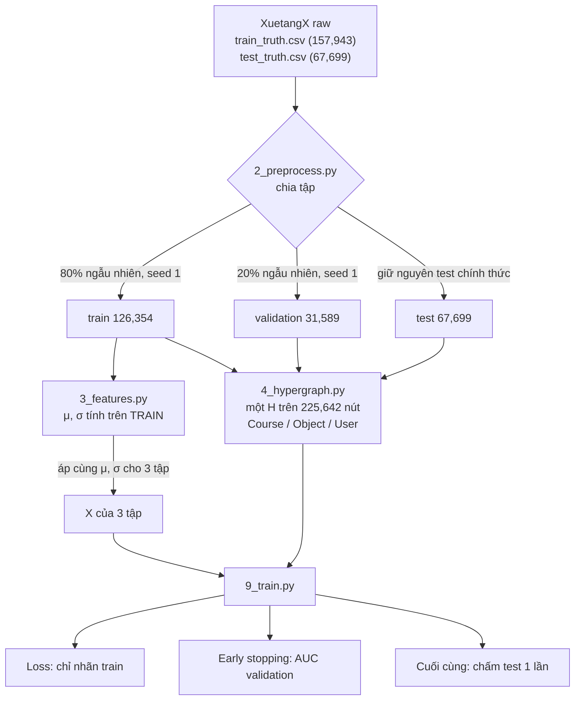
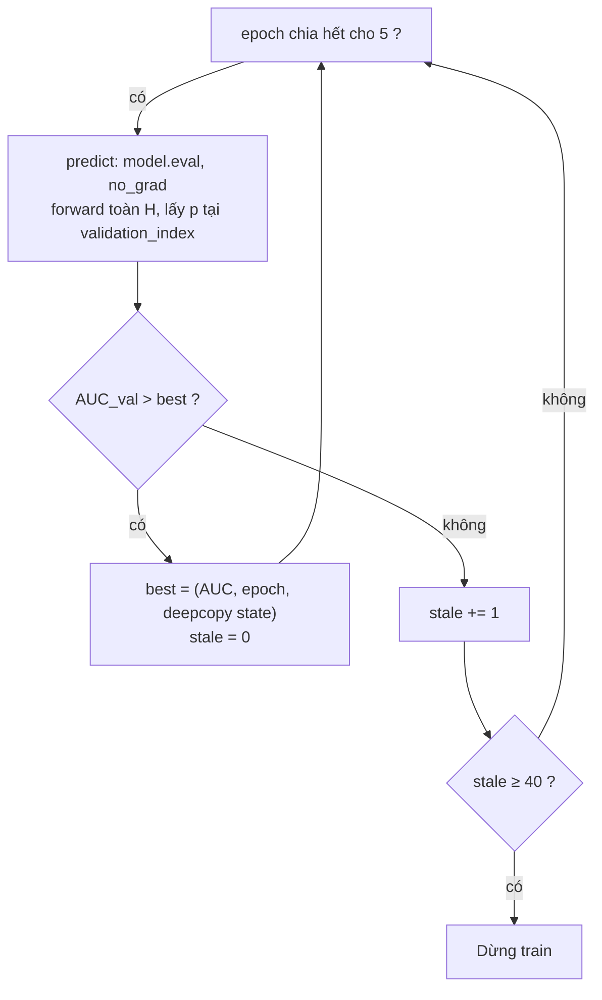

# Train / Validation / Test trong project HGNN dropout (XuetangX)

> [!summary] Tóm tắt
> - **Test** = test chính thức của XuetangX: 67,699 enrollment.
> - **Validation** = 20% ngẫu nhiên của train chính thức: 31,589 enrollment.
> - **Train** = 80% còn lại: 126,354 enrollment.
> - Một hypergraph chứa cả 225,642 enrollment. Loss chỉ dùng nhãn train, early stopping dùng AUC validation, test chấm một lần với best state.

## 1. Toàn bộ quy trình



| Bước | File | Train | Validation | Test |
|---|---|---|---|---|
| 1. Chia tập | [2_preprocess.py](../src/2_preprocess.py) | 80% train chính thức | 20% train chính thức | test chính thức |
| 2. Chuẩn hóa X | [3_features.py](../src/3_features.py) | tính μ, σ | dùng μ, σ của train | dùng μ, σ của train |
| 3. Dựng H | [4_hypergraph.py](../src/4_hypergraph.py) | có trong H | có trong H | có trong H |
| 4. Train | [9_train.py](../src/9_train.py) | nhãn vào loss | — | — |
| 5. Early stopping | [9_train.py](../src/9_train.py) | — | AUC chọn epoch | — |
| 6. Báo cáo | [9_train.py](../src/9_train.py), [10_summary.py](../src/10_summary.py) | — | ghi kèm | chấm 1 lần |

## 2. Bước 1: chia tập ([2_preprocess.py](../src/2_preprocess.py))

- **Test**: lấy nguyên `test_truth.csv` chính thức, không đụng vào.
- **Validation**: hàm `split_train_enrollments` xáo danh sách enrollment của `train_truth.csv` bằng `random.Random(SPLIT_SEED = 1)`, lấy `n_train = ⌊0.8·n⌋` enrollment đầu làm train, phần còn lại làm validation.
- Chia **theo enrollment**, không theo học viên hay thời gian. Lý do: test chính thức cũng được chia ngẫu nhiên theo enrollment (audit 2026-10-04): cả 247 khóa đều có mặt ở mọi tập, mỗi khóa ~30% là test, 76.1% enrollment test có học viên cũng có enrollment train. Validation chia giống test thì mới mô phỏng đúng test.
- Enrollment không có sự kiện nào trong ngày 0–34 vẫn được **giữ** (đặc trưng hành vi = 0). Bản server cũ từng bỏ 3,305 enrollment này, nên test cũ chỉ có 66,745.
- Kết quả: ba file `train.csv`, `validation.csv`, `test.csv`. Mỗi file đánh số nút riêng `0..n−1`.
- Cách chia **cố định** cho mọi lần chạy. Seed huấn luyện (1, 11, 111, 1111, 11111) không làm thay đổi cách chia.

## 3. Bước 2: chuẩn hóa đặc trưng ([3_features.py](../src/3_features.py))

```
x = (log(1 + c) − μ_train) / σ_train     # c = số đếm hành vi, μ và σ tính trên train
a = (age − μ_train) / σ_train            # tuổi, z-score
```

- μ, σ chỉ tính trên **train**, rồi áp cùng giá trị đó cho validation và test.
- Các cột one-hot (giới tính, học vấn, danh mục khóa) giữ nguyên 0/1.
- Kết quả: `train/X.npy`, `validation/X.npy`, `test/X.npy`.

## 4. Bước 3: dựng hypergraph ([4_hypergraph.py](../src/4_hypergraph.py))

- Một H duy nhất trên **mọi** enrollment (transductive), đánh số nút toàn cục theo thứ tự:

| Tập | Id toàn cục |
|---|---|
| train | 0 … 126,353 |
| validation | 126,354 … 157,942 |
| test | 157,943 … 225,641 |

- Ba họ hyperedge, **chỉ dựa trên cấu trúc**, không dùng nhãn:
  - Course: `e_C(c) = {v : course(v) = c}` → 247 hyperedge
  - Object: `e_O(o) = {v : v dùng object o trong ngày 0–34}` → 22,421
  - User: `e_U(l) = {v : user(v) = l}` → 64,672, gồm mọi enrollment của học viên ở cả 3 tập
  - Self-loop: mỗi nút một cái, thêm lúc load ([5_graph_data.py](../src/5_graph_data.py))
- Bỏ hyperedge có `|e| < 2`. Tổng 3,222,033 membership.
- `hypergraph.npz` lưu thêm `labels [N]` và `split [N]` (0 = train, 1 = validation, 2 = test).
- [5_graph_data.py](../src/5_graph_data.py) ghép X theo đúng thứ tự đó, `X = [X_train; X_validation; X_test]`, và tạo `train_index`, `validation_index`, `test_index` từ `split`.

Nghĩa là: lúc train, nút validation và test **có mặt** trong H. Đặc trưng X của chúng tham gia truyền tin qua hyperedge, nhưng **nhãn** của chúng thì không.

## 5. Bước 4: train ([9_train.py](../src/9_train.py), `train_one_seed`)

```
mỗi epoch (full-batch):
    logits = model(X, H)                         # forward cho cả 225,642 nút
    L = BCE(logits[train_index], y_train)        # chỉ nút train, chỉ nhãn train
    clip ‖g‖ ≤ 5, Adam cập nhật θ
```

- Chỉ `train_labels` được đưa lên device. Nhãn validation và test nằm ở NumPy, chỉ hàm `metrics` đọc chúng.
- Mỗi 50 epoch, log in thêm `train_auc` để theo dõi.

## 6. Bước 5: validation và early stopping



| Tham số ([0_config.py](../src/0_config.py)) | Giá trị |
|---|---|
| Số epoch tối đa | 1000 |
| Chấm validation | mỗi 5 epoch |
| Patience | 40 lần chấm (= 200 epoch không cải thiện) |
| Tiêu chí | AUC validation |

- Dùng **AUC** thay cho accuracy vì dữ liệu lệch lớp (dropout ≈ 0.76): luôn đoán "bỏ học" đã được accuracy 0.76, nhưng AUC chỉ 0.5.
- Best state giữ trong RAM (`copy.deepcopy(model.state_dict())`), không lưu file.
- Hàm `predict` tắt dropout (`model.eval()`), không tính gradient, forward toàn H rồi lấy `σ(logit)` tại chỉ số cần chấm.

## 7. Bước 6: test, một lần

1. Nạp best state.
2. `predict` cho validation và test (cùng một cách forward như trên).
3. Tính metric ở ngưỡng `p ≥ 0.5`: AUC, AUPRC, accuracy, precision, recall, F1 (lớp dropout = 1).
4. Ghi **một dòng** vào `outputs/results.csv`: kịch bản, seed, `best_epoch`, `epochs_run`, metric val, metric test, trọng số họ W.
5. Mỗi kịch bản chạy 5 seed; [10_summary.py](../src/10_summary.py) tính **mean ± std** và chênh lệch so với M.

Test không được dùng cho bất kỳ quyết định nào (epoch, kịch bản, siêu tham số). Con số báo cáo là **test**; số val chỉ ghi kèm, vì nó đã được dùng để chọn epoch nên hơi lạc quan.

## 8. Ai thấy gì

| Thông tin | Train | Validation | Test |
|---|---|---|---|
| Đặc trưng X khi forward | ✅ | ✅ | ✅ |
| Có mặt trong H | ✅ | ✅ | ✅ |
| Dùng để tính μ, σ | ✅ | ❌ | ❌ |
| Nhãn trong loss | ✅ | ❌ | ❌ |
| Nhãn để chọn epoch | ❌ | ✅ | ❌ |
| Nhãn để báo cáo | ❌ | ghi kèm | ✅ |

> [!warning] Hyperedge User gom cả khóa học sau
> Hyperedge User chứa mọi enrollment của học viên, kể cả khóa bắt đầu muộn hơn. Đây là lựa chọn có chủ ý (như SIG-Net, MST-GCN), hợp với việc test chính thức được chia ngẫu nhiên chứ không chia theo thời gian.

## 9. Kiểm chứng (đo ngày 2026-10-08, máy local, commit d5c7771)

| # | Kiểm tra | Kết quả |
|---|---|---|
| C0 | Enrollment id trùng giữa 3 file CSV | train∩val = 0, train∩test = 0, val∩test = 0; tổng 225,642 ✅ |
| C1 | Kích thước, tỉ lệ dropout | train 126,354 (0.7582), val 31,589 (0.7601), test 67,699 (0.7580); train/(train+val) = 0.8000 ✅ |
| C2 | Thứ tự id toàn cục train → val → test | True ✅ |
| C3 | Thống kê X sau chuẩn hóa | train: mọi cột mean = 0.0000, std = 1.0000; val: max\|mean\| 0.0197, std 0.98–1.26; test: max\|mean\| 0.0107, std 0.79–1.13 → scaler chỉ fit trên train ✅ |
| C4 | Hyperedge trộn nhiều tập | Course: 100% chứa cả 3 tập; User: 87.2% có nút train, 5.5% chỉ có nút test ✅ |
| C5 | Nút cùng hyperedge User với một nút train | val 75.6%, test 76.1% (khớp audit 04/10) ✅ |
| C6 | Mỗi nút thuộc đúng 1 hyperedge Course | True ✅ |
| C7 | Đảo cả 99,288 nhãn val/test rồi train M 5 epoch | Loss từng epoch giống hệt, max \|chênh lệch trọng số\| = **0.0** → nhãn val/test không vào train ✅ |

> [!caution] Dữ liệu local
> `data/processed/simple/*/X.npy` ở local là bản ngày 2026-10-04 (**90 cột**), code hiện tại sinh **89 cột**. C3 đo trên bản cũ; kết luận không đổi. Muốn local khớp server: chạy lại `python src/3_features.py`.

### Script kiểm chứng (chạy từ thư mục gốc project)

**C0** (bash, đọc ~6.6 GB, vài phút)

```bash
cd data/processed/simple
for f in train validation test; do
  awk -F, 'NR>1 && !seen[$2]++ {print $2}' $f.csv | sort > /tmp/ids_$f.txt &
done; wait
comm -12 /tmp/ids_train.txt /tmp/ids_validation.txt | wc -l   # phải = 0
comm -12 /tmp/ids_train.txt /tmp/ids_test.txt       | wc -l   # phải = 0
comm -12 /tmp/ids_validation.txt /tmp/ids_test.txt  | wc -l   # phải = 0
```

**C1–C4** (< 1 giây)

```python
import sys
from importlib import import_module
import numpy as np
sys.path.insert(0, "src")
config = import_module("0_config")
data = import_module("5_graph_data").load_graph()
split, labels, g = data["split"], data["labels"], data["graph"]

# C1: sizes and dropout rate per split
for k, name in enumerate(config.SPLITS):
    print(name, int(np.sum(split == k)), labels[split == k].mean())

# C2: global ids ordered train -> validation -> test
print(np.all(np.diff(split) >= 0))

# C3: train columns exactly mean 0 / std 1, validation and test only close
for k, name in enumerate(config.SPLITS):
    xb = data["features"][split == k, :config.BEHAVIOR_FEATURE_COUNT].astype(np.float64)
    print(name, np.abs(xb.mean(0)).max(), xb.std(0).min(), xb.std(0).max())

# C4: share of hyperedges of each family that contain a node of each split
fam, nid, eid = g["edge_family"], g["node_ids"], g["edge_ids"]
has = np.zeros((len(fam), 3), dtype=bool)
for k in range(3):
    has[np.unique(eid[split[nid] == k]), k] = True
for f, fname in enumerate(("course", "object", "user")):
    print(fname, has[fam == f].mean(0))
```

**C7** (~2 phút CPU). Optimizer rút gọn một nhóm tham số, vì chỉ cần so hai lần chạy với nhau.

```python
import sys
from importlib import import_module
import numpy as np, torch
from torch.nn import functional as F
sys.path.insert(0, "src")
torch.set_num_threads(1)          # many CPU threads sum in different orders -> ~1e-7 noise
config = import_module("0_config")
graph_data = import_module("5_graph_data")
prepare_graph = import_module("6_hgnn").prepare_graph
DropoutModel = import_module("8_model").DropoutModel

def run(labels, epochs=5):
    loaded = graph_data.load_graph(); loaded["labels"] = labels
    data = graph_data.apply_scenario(loaded, config.SCENARIOS["M"])
    torch.manual_seed(1)
    x = torch.as_tensor(data["features"]); graph = prepare_graph(data["graph"], "cpu")
    idx = torch.as_tensor(data["train_index"]); y = torch.as_tensor(data["labels"][data["train_index"]])
    t = config.TRAIN
    model = DropoutModel(x.shape[1], t["hidden_dim"], t["dropout"])
    opt = torch.optim.Adam(model.parameters(), lr=t["learning_rate"], weight_decay=t["weight_decay"])
    losses = []
    for _ in range(epochs):
        model.train(); opt.zero_grad()
        loss = F.binary_cross_entropy_with_logits(model(x, graph)[idx], y)
        loss.backward(); opt.step(); losses.append(loss.item())
    return losses, torch.cat([p.detach().flatten() for p in model.parameters()])

loaded = graph_data.load_graph()
real, split = loaded["labels"], loaded["split"]
flipped = real.copy(); flipped[split != 0] = 1 - flipped[split != 0]
la, wa = run(real); lb, wb = run(flipped)
print(la == lb, float((wa - wb).abs().max()))   # must print: True 0.0
```
