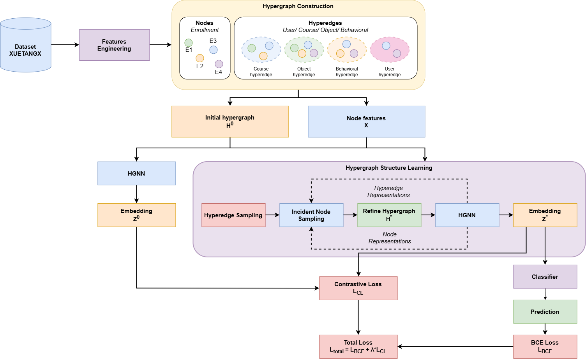

# Tài liệu project: từ XuetangX đến dự đoán dropout

Tài liệu này đi theo từng khối trong sơ đồ, sau đó giải thích tám file code cùng
input/output. Đọc từ trên xuống sẽ thấy một enrollment đi qua pipeline thế nào.



> **Lưu ý về hình:** hình có *User hyperedge*, nhưng code hiện chỉ tạo Course,
> Object và Behavioral hyperedge. `user_id` được dùng để chia dữ liệu theo user
> và tạo user feature. Hình cũng gợi ý cập nhật lặp giữa node và hyperedge;
> code hiện refine `H0` thành `H*` **một lần trong mỗi `forward()`**.

## 1. Các khái niệm cần biết

| Tên | Nghĩa trong project |
|---|---|
| Enrollment | Một lần một học viên đăng ký một course. **Mỗi enrollment là một node**; một user có thể có nhiều node. |
| `node_id` | Số thứ tự của enrollment trong `nodes.csv` và hàng tương ứng trong `X_seed_*.npy`. |
| Nhãn | `1` là dropout; `0` là không dropout. |
| Hyperedge | Một nhóm có thể chứa nhiều node, chẳng hạn các enrollment cùng course. |
| `H0` | Ma trận liên thuộc ban đầu: hàng là node, cột là hyperedge; ô bằng 1 nếu node thuộc edge. |
| `X` | Ma trận đặc trưng đầu vào, một hàng cho mỗi node. |
| `Z0`, `Z*` | Biểu diễn node trước và sau khi học lại cấu trúc hypergraph. |
| `H*` | Ma trận liên thuộc có trọng số sau bước HSL. |
| Logit | Điểm thô của classifier; `sigmoid(logit)` là xác suất dropout. |
| Seed | Số cố định để tạo split và điều khiển ngẫu nhiên khi thí nghiệm. |

Ký hiệu dưới đây: `N` là số node toàn bộ dữ liệu, `N_train` là số train node,
`E` là số train hyperedge, `F` là số feature được chọn và `D` là kích thước
embedding (mặc định 64).

## 2. Đi theo các khối trong hình

### Dataset XUETANGX

`download.py` tải, kiểm tra SHA-256 và giải nén dữ liệu. Bộ XuetangX này đã
có CSV, nên hàm đổi JSON sang CSV chỉ là tiện ích tùy chọn. `preprocess.py`
ghép log với nhãn, giữ event ở ngày 0–34 tính từ ngày bắt đầu course, rồi
gán một `node_id` cho mỗi enrollment. Nó chia train/validation/test theo user:
mọi enrollment của cùng user ở cùng một split.

**Input:** sáu CSV gốc trong `data/raw/xuetangx/`.
**Output:** `nodes.csv`, `events_35d.csv.gz`, `users.csv`, `courses.csv`,
`split_seed_*.csv` trong `data/processed/simple/`.

`source_partition` trong `nodes.csv` chỉ cho biết enrollment đến từ file
`train_*` hay `test_*` gốc. **Split thí nghiệm** nằm ở `split_seed_*.csv`.

### Features Engineering

`features.py` tạo 60 behavioral feature: 35 số đếm event theo ngày, 23 số
đếm theo action, số session khác nhau và số object khác nhau. Số đếm được
biến đổi bằng `log1p`, rồi chuẩn hóa bằng mean và standard deviation **chỉ
tính trên train node** của seed đang xét. Nó thêm 15 user feature và 21 course
feature. Giá trị số thiếu được điền bằng median train; category rỗng đi vào
cột `missing`.

**Input:** nodes, event 35 ngày, user/course metadata và split.
**Output:** `X_seed_*.npy` kích thước `N × 96`,
`feature_stats_seed_*.json`, `node_objects.csv.gz`. Hàng `i` của `X` là
node có `node_id=i`.

### Hypergraph Construction: Nodes và Hyperedges

`hypergraph.py` chỉ dùng **train node** để tạo ba loại edge:

| Loại edge | Quy tắc |
|---|---|
| Course | Các enrollment cùng `course_id`. |
| Object | Các enrollment cùng `(course_id, object_id, object_type)`. Object lấy từ action video, assignment, forum; nhóm web page không tạo Object edge. |
| Behavioral | Một train node với `k` train node gần nhất theo cosine của 60 behavioral feature. FAISS HNSW tìm láng giềng gần đúng. |

Edge có dưới hai thành viên bị bỏ; Behavioral edge trùng tập thành viên được
gộp. Với validation/test, neighbors vẫn chỉ được tìm trong train node để dựng
graph đánh giá sau này.

**Input:** `nodes.csv`, split, `X_seed_*.npy`, `node_objects.csv.gz`.
**Output:** cặp `edge_id,node_id` trong `edge_memberships_seed_*.csv.gz`,
metadata trong `edge_meta_seed_*.csv`, `neighbors_seed_*.npy`,
`graph_config_seed_*.json`.

### Initial hypergraph `H0` và Node features `X`

`model.py:build_h0()` đổi danh sách membership thành ma trận thưa `H0` kích
thước `N_train × E`. Hàng `H0` là **vị trí trong train**, có thể khác
`node_id`; `train_ids_seed_*.npy` lưu ánh xạ `train_ids[row] = node_id`.
`load_train_graph()` lấy `X[train_ids]` để thứ tự hàng của `X` và `H0` khớp.

| `feature_set` | Thành phần của `X` | `F` |
|---|---|---:|
| `behavior` | behavioral | 60 |
| `behavior_user` | behavioral + user | 75 |
| `behavior_course` | behavioral + course | 81 |
| `full` | tất cả | 96 |

**Input:** edge membership, edge metadata, split và `X_seed_*.npy`.
**Output trên đĩa:** `H0_seed_*.npz`, `train_ids_seed_*.npy`.
**Output trong RAM:** `x: N_train × F`, `h0: N_train × E`, nhãn `y`,
loại edge `families` và kích thước edge `sizes`.

### HGNN đầu tiên → Embedding `Z0`

`HGSLModel.encode(x, h)` trong `model.py` cho node nhận thông tin qua những
hyperedge chứa nó. Code dùng hai lớp tuyến tính, phép truyền qua hypergraph,
ReLU và dropout. Phép truyền có dạng
`G = Dv^(-1/2) H De^(-1) Hᵀ Dv^(-1/2)`, trong đó `Dv`, `De` là bậc node và
edge tính từ `H`.

**Input:** `x: N_train × F`, `H0: N_train × E`.
**Output:** `Z0: N_train × D` trong RAM; không có file `Z0` riêng.

### Hypergraph Structure Learning (HSL)

`hsl.py` nhận `Z0`, `H0`. Khi train, code lấy mẫu edge theo loại/kích thước.
Với mỗi edge được chọn, nó lấy các node đang thuộc edge (*positive*) và node
chưa thuộc edge (*negative*). Trung bình embedding của positive tạo biểu diễn
edge; một scorer cho điểm từng node ứng viên. Mặc định nó giữ `top_r` score,
đảm bảo còn ít nhất một positive trong mỗi edge được chọn. Edge không được
chọn giữ nguyên. Nếu node trở nên cô lập, code khôi phục một membership cũ.
Giá trị membership được học là `sigmoid(score)`.

Khi validation/test, code xét toàn bộ edge trong graph cục bộ và chọn ứng
viên cố định để đổi batch size không làm đổi kết quả.

**Input:** `Z0`, `H0`, `families`, `sizes`, tham số scorer, cấu hình lấy mẫu.
**Output:** PyTorch sparse tensor `H*` cùng kích thước `H0` và dictionary
`audit` ghi số edge/candidate/membership. `H*` chỉ tồn tại trong `forward()`.

### HGNN thứ hai → Embedding `Z*`

`HGSLModel.forward()` gọi lại **cùng `encode()` với cùng trọng số**, nhưng
dùng `H*` thay `H0`. Kết nối thay đổi nên biểu diễn node có thể thay đổi.

**Input:** `x` và `H*`. **Output:** `Z*: N_train × D` trong RAM.

### Classifier → Prediction

Một lớp tuyến tính đổi từng hàng `Z*` thành logit. Khi đánh giá, `sigmoid`
đổi logit thành xác suất dropout. Ngưỡng 0,5 dùng để tính precision, recall,
F1; AUC/AUPRC dùng score liên tục.

**Input:** `Z*`. **Output:** logit cho mỗi node; khi đánh giá chỉ lấy score
của target validation/test ở vị trí đầu graph cục bộ.

### BCE Loss, Contrastive Loss, Total Loss

`losses.py` tính weighted BCE giữa logit và nhãn train. Trọng số lớp dương
là `số train node nhãn 0 / số train node nhãn 1`. Contrastive InfoNCE coi
`Z0[i]` và `Z*[i]` của cùng train node là positive; các node khác trong mẫu
là negative. Code tính theo hai chiều và lấy trung bình.

`L_total = L_BCE + lambda_cl × L_CL`, mặc định `lambda_cl=0.1`.
Với `--no-hsl`, phần refine bị bỏ và contrastive loss bằng 0 để chạy HGNN
ablation.

**Input:** logits, train labels, `Z0`, `Z*`, chỉ số node lấy mẫu.
**Output:** một scalar loss để `backward()` cùng số BCE/contrastive để ghi
báo cáo. Validation/test không cập nhật trọng số.

### Train, Validation và Test

`train.py` học trên graph train toàn cục. Sau mỗi epoch, nó đo validation
AUC, giữ checkpoint của epoch tốt nhất và mặc định dừng sớm sau năm epoch
liên tiếp không cải thiện. `test()` đọc checkpoint đã chọn rồi tính AUC,
AUPRC, F1, precision, recall trên test.

Validation/test dùng **một graph cục bộ cho mỗi target**: target ở vị trí
đầu, các node còn lại chỉ là train reference. Course/Object/Behavioral edge
của target được dựng lại từ train data; target khác không đi vào graph này.

**Input:** train graph, validation data, cấu hình; khi test thêm checkpoint.
**Output:** `outputs/runs/*.pt` và `outputs/reports/*.json`. Checkpoint lưu
trọng số, cấu hình và hash của các file dữ liệu; `test()` báo lỗi nếu dữ liệu
đã đổi sau khi train.

## 3. Chi tiết từng file code và input/output

Các đường dẫn tính từ thư mục gốc project. `*` trong tên file là một trong
năm seed: `1`, `11`, `111`, `1111`, `11111`.

### 1 — [`src/download.py`](../src/download.py)

- **Đọc các hàm:** `download()`, `sha256()`; `json_to_csv()` là tiện ích
  riêng cho JSON array hoặc JSONL nếu em có dữ liệu loại này.
- **Input:** URL/SHA-256 trong `FILES`, thư mục đích mặc định
  `data/raw/xuetangx/`.
- **Xử lý:** tải archive và hai metadata CSV, kiểm tra SHA-256, giải nén bốn
  CSV từ archive.
- **Output:** `train_log.csv`, `test_log.csv`, `train_truth.csv`,
  `test_truth.csv`, `user_info.csv`, `course_info.csv`. Archive vẫn được giữ.
- **Tự xem:** lấy một `enroll_id` từ `train_log.csv`, tìm nhãn của nó trong
  `train_truth.csv`.

### 2 — [`src/preprocess.py`](../src/preprocess.py)

- **Đọc các hàm:** `preprocess()`, rồi `_split_users()`.
- **Input:** sáu CSV gốc. Log cần `enroll_id`, `username`, `course_id`,
  `session_id`, `action`, `object`, `time`; truth cần `enroll_id`, `truth`.
- **Xử lý:** kiểm tra log/nhãn, tính `course_day`, giữ event ngày 0–34,
  gán `node_id`, chia train/validation/test theo user với tỷ lệ **số user
  mục tiêu** 64/16/20 cho mỗi seed.
- **Output:** `nodes.csv` với cột
  `node_id,enroll_id,user_id,course_id,source_partition,label`;
  `events_35d.csv.gz` với cột
  `enroll_id,source_partition,session_id,action,object_id,course_day,course_id`;
  `users.csv`, `courses.csv` và `split_seed_*.csv` (`node_id,split`).
- **Lưu ý:** code kiểm tra tổng số hàng chuẩn của XuetangX-247. Cờ
  `--allow-small` dành cho dữ liệu nhỏ/tự tạo.

### 3 — [`src/features.py`](../src/features.py)

- **Đọc các hàm:** `build_features()`, `feature_names()`, `_scale_numeric()`.
- **Input:** `nodes.csv`, `events_35d.csv.gz`, `users.csv`, `courses.csv`,
  `split_seed_*.csv`.
- **Xử lý:** đếm event/session/object; chia event vào bucket CSV tạm để
  không giữ mọi event trong RAM; tạo context feature; chuẩn hóa theo train
  split của từng seed.
- **Output:** `X_seed_*.npy` (`N × 96`, `float32`),
  `feature_stats_seed_*.json` (tên cột và tham số chuẩn hóa),
  `node_objects.csv.gz` (`node_id,course_id,object_id,object_type`).
- **Lưu ý:** bucket CSV được xóa khi chạy xong; `node_objects.csv.gz`
  được dùng tiếp để tạo Object hyperedge.

### 4 — [`src/hypergraph.py`](../src/hypergraph.py)

- **Đọc các hàm:** `build_hyperedges()`, `_neighbors()`.
- **Input:** `nodes.csv`, split, `X_seed_*.npy`, `node_objects.csv.gz`;
  mặc định `k=10`, `k_max=20`.
- **Xử lý:** FAISS tìm train neighbors theo cosine; tạo Course/Object/
  Behavioral edge; bỏ edge có dưới hai thành viên.
- **Output:** `neighbors_seed_*.npy` (`N × k_max`),
  `edge_memberships_seed_*.csv.gz` (`edge_id,node_id`),
  `edge_meta_seed_*.csv` (`edge_id,family,course_id,object_id,object_type,anchor_id,size`),
  `graph_config_seed_*.json`.
- **Lưu ý:** neighbors có hàng cho mọi node, nhưng từng neighbor đều là
  train node. Tìm kiếm HNSW là gần đúng, không phải duyệt hết mọi cặp.

### 5 — [`src/model.py`](../src/model.py)

- **Đọc các hàm:** `build_h0()`, `load_train_graph()`, `local_graph()`,
  `HGSLModel.forward()`, `HGSLModel.encode()`.
- **Input để tạo H0:** split, edge membership và edge metadata của seed.
- **Output trên đĩa:** `H0_seed_*.npz` (SciPy CSR sparse,
  `N_train × E`), `train_ids_seed_*.npy`.
- **Input lúc train:** `x`, `h0`, `families`, `sizes`, random generator,
  cấu hình HSL.
- **Output của `forward()`:** dictionary gồm `logits`, `z0`, `z_star`,
  `h_star`, `audit`; chúng ở RAM, không tự ghi ra file.
- **Input khi đánh giá:** target `node_id`, train reference, `X`, neighbors,
  chỉ mục course/object.
- **Lưu ý:** `_SparseValuesMM` giúp gradient đi qua giá trị ma trận thưa
  mà không tạo ma trận node × edge dạng dense.

### 6 — [`src/hsl.py`](../src/hsl.py)

- **Đọc các hàm:** `refine_hypergraph()`, `sample_edges()`.
- **Input:** `Z0`, `H0`, `families`, `sizes`, hai projection, bias,
  random generator và các tham số lấy mẫu.
- **Xử lý:** chọn edge/node ứng viên, tính membership score, giữ các
  membership có score cao, giữ nguyên edge chưa chọn, sửa node cô lập.
- **Output:** `H*` dạng PyTorch sparse tensor có giá trị học được; `audit`
  ghi số edge, candidate, membership và node được khôi phục.
- **Lưu ý:** train lấy mẫu edge; đánh giá dùng `deterministic=True` để
  refine toàn bộ edge trong graph cục bộ.

### 7 — [`src/losses.py`](../src/losses.py)

- **Đọc các hàm:** `train_pos_weight()`, `contrastive_loss()`, `total_loss()`.
- **Input:** train labels, logits, `Z0`, `Z*`, chỉ số train node lấy mẫu,
  `lambda_cl`, temperature.
- **Output:** `total_loss()` trả scalar tensor để học và dictionary
  `bce`, `contrastive` để theo dõi.
- **Lưu ý:** nhãn validation/test không đi vào loss khi train.

### 8 — [`src/train.py`](../src/train.py)

- **Đọc các hàm:** `train()`, `evaluate()`, `test()`, sau đó `metrics()`
  và `artifact_hashes()`.
- **Input train:** `X_seed_*.npy`, `H0_seed_*.npz`, train labels, graph
  metadata, validation data và cấu hình train.
- **Output train:** `outputs/runs/simple_hgsl_<feature_set>_seed_<seed>_<id>.pt`
  (hoặc `simple_hgnn_...pt` với `--no-hsl`) và báo cáo
  `outputs/reports/simple_<...>_train.json` gồm lịch sử loss/validation.
- **Input test:** checkpoint và **đúng processed data** đã dùng lúc train.
- **Output test:** `outputs/reports/<tên-checkpoint>_test.json` gồm metric
  và số liệu refine; `test()` cũng trả dictionary kết quả.
- **Lưu ý:** `<id>` là 10 ký tự từ cấu hình và hash dữ liệu. Chạy lại cùng
  cấu hình trên cùng dữ liệu sẽ ghi đè checkpoint đó. `--validation-limit`
  và `--test-limit` chỉ phục vụ kiểm tra nhanh, không dùng cho kết quả cuối.

## 4. Bản đồ file dữ liệu theo thứ tự tạo

```text
data/raw/xuetangx/*.csv
    │ preprocess.py
    ├── nodes.csv + users.csv + courses.csv
    ├── events_35d.csv.gz
    └── split_seed_*.csv
          │ features.py
          ├── X_seed_*.npy + feature_stats_seed_*.json
          └── node_objects.csv.gz
                │ hypergraph.py
                ├── neighbors_seed_*.npy
                ├── edge_memberships_seed_*.csv.gz
                ├── edge_meta_seed_*.csv
                └── graph_config_seed_*.json
                      │ model.py: build_h0()
                      ├── H0_seed_*.npz
                      └── train_ids_seed_*.npy
                            │ train.py + model.py + hsl.py + losses.py
                            ├── outputs/runs/*.pt
                            └── outputs/reports/*.json
```

`download.py` tạo sáu CSV gốc ở đầu sơ đồ. Bảng trung gian là CSV/CSV nén;
`X` là NumPy `.npy`; `H0` là sparse `.npz`; checkpoint là PyTorch `.pt`.
Project không dùng DuckDB, thư viện cơ sở dữ liệu hay Parquet.

Một ví dụ nhỏ về ý nghĩa của `H0`: nếu node 0 và 1 cùng Course edge, còn
node 1 và 2 cùng Object edge, ma trận liên thuộc có thể là:

```text
           Course  Object
node 0        1       0
node 1        1       1
node 2        0       1
```

Khi HSL cho node 2 thêm membership ở Course edge, ô `(node 2, Course)`
của `H*` có thể thành một giá trị trong `(0, 1)`. Đây chỉ là ví dụ để đọc
ma trận; giá trị thực do scorer học từ embedding.

## 5. Chạy một seed từ thư mục gốc project

```powershell
.\.venv\Scripts\python.exe src/download.py
.\.venv\Scripts\python.exe src/preprocess.py
.\.venv\Scripts\python.exe src/features.py
.\.venv\Scripts\python.exe src/hypergraph.py --seed 1 --k 10
.\.venv\Scripts\python.exe src/model.py --seed 1
.\.venv\Scripts\python.exe src/train.py --seed 1 --feature-set full --epochs 50
```

Sau khi đã chọn cấu hình bằng validation, chạy test với đúng checkpoint
được in ở cuối train. Ví dụ PowerShell lấy file mới nhất cho seed 1:

```powershell
$checkpoint = Get-ChildItem outputs/runs/simple_hgsl_full_seed_1_*.pt | Sort-Object LastWriteTime -Descending | Select-Object -First 1
.\.venv\Scripts\python.exe src/train.py --mode test --checkpoint $checkpoint.FullName
```

`features.py` tạo `X` cho cả năm seed; `hypergraph.py` và `model.py` cần
chạy riêng cho mỗi seed sẽ train. Mặc định `train.py` dùng `behavior` 60
chiều; ví dụ trên chọn `full` 96 chiều. `--no-hsl` chạy HGNN ablation.

## 6. Tự theo dấu một enrollment

Giả sử em chọn một `enroll_id` trong `train_truth.csv`:

1. Tìm nó trong `nodes.csv` với `source_partition=train` để lấy `node_id`.
   Tên partition chưa nói node thuộc train split của thí nghiệm.
2. Mở `split_seed_1.csv`, tìm `node_id` để biết nó thuộc train,
   validation hay test của seed 1.
3. Đọc hàng `node_id` của `X_seed_1.npy`, đối chiếu tên cột trong
   `feature_stats_seed_1.json`. Cần NumPy để mở `.npy`.
4. Nếu là train node, tìm nó trong `edge_memberships_seed_1.csv.gz`, rồi
   nối `edge_id` sang `edge_meta_seed_1.csv` để biết nó thuộc loại edge nào.
5. Tìm vị trí của `node_id` trong `train_ids_seed_1.npy`: đây là số hàng
   của nó trong `H0_seed_1.npz`. Số hàng này có thể khác `node_id`.
6. Trong `HGSLModel.forward()`, theo `x + H0 → Z0 → H* → Z* → logit`.
   `losses.py` so logit với nhãn train và so `Z0` với `Z*`.

Nếu node thuộc validation/test, bước 4–5 được thay bằng `local_graph()`:
nó dựng graph tạm cho target cùng những train node tham chiếu.

## 7. Ba điểm dễ hiểu nhầm

1. **Một user có thể có nhiều node.** Tất cả node của user ở cùng split
   để giảm rò rỉ thông tin giữa train và đánh giá.
2. **`H0` train khác graph đánh giá.** `H0_seed_*.npz` chỉ chứa train node;
   validation/test dùng graph cục bộ được dựng lúc `evaluate()`.
3. **Test code không phải kết quả nghiên cứu.**
   `tests/test_simple_pipeline.py` kiểm tra pipeline và gradient HSL trên
   dữ liệu tự tạo. Để báo cáo metric cần chạy dữ liệu thật, validation đầy
   đủ, năm seed và các ablation đã chọn.
